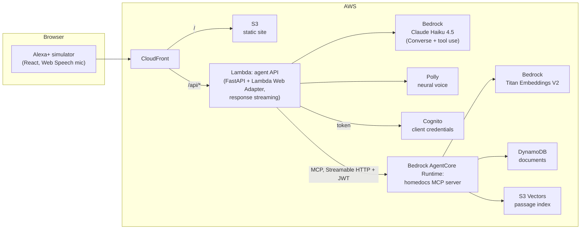

# HomeDocs for Alexa+

Ask Alexa about your own household paperwork. "When does my car insurance renew?",
"Is my laptop still under warranty?", "Can I have a cat in my apartment?" HomeDocs
answers in a sentence or two, says which document the answer came from, and lights
the ring yellow when a bill, renewal or expiry is coming up.

Built for the Amazon "Build, Ship, Shape" hackathon, Alexa+ track, as a
**self-hosted MCP server** (spec 2025-11-25, Streamable HTTP) plus a **web app that
simulates an Alexa+ device** for the demo.

## Try the live demo

**https://d296qqe0ajd20y.cloudfront.net** (Chrome or Edge; allow the microphone, or
type your questions).

The site asks for a **demo passcode**, because every question uses paid AWS services.
Hackathon judges: you'll find the passcode in the Devpost submission's **Additional
info**. It's on the first line of the answer to "Which AWS services did you
incorporate and how?" The demo data is explained in
[About the demo data](#about-the-demo-data).

## What it does

- **Answers questions from your documents.** Semantic search over passages of your
  bills, leases, warranties, insurance policies and ID documents.
- **Reads new documents for you.** Upload a PDF or a phone photo; Bedrock pulls out
  the title, provider, key dates and a summary, and it is searchable right away.
- **Remembers things you say, and forgets on request.** "Remember that my car
  registration renews May 3rd." "Forget my old lease."
- **Tells you what is coming up.** On start it checks the next 14 days and shows a
  yellow notification ring, like an Echo. "What are my notifications?" reads them out.
- **Feels like a voice assistant.** Answers stream in and are spoken sentence by
  sentence while Claude is still writing; tap the ring to interrupt.
- **Shows its work.** A side panel lists every MCP tool call live, with inputs,
  timing and results.

## About the demo data

The public demo's database always starts with **five made-up sample documents**: car
insurance, dishwasher warranty, apartment lease, internet bill and passport.

- **Their dates are offsets from today**, not fixed dates: the internet bill is always
  due in 6 days, the dishwasher warranty always ends in 20 days, the car insurance
  always renews in 36 days, and so on. Whenever you try it, there is one notification
  due soon and a few more dates coming up. This is on purpose, not a bug.
- **Every night at 4 AM (Atlantic time)** a scheduled job resets the demo: it deletes
  every document added during the day (uploads and spoken notes, with their search
  passages), then reloads the five samples, recalculating their dates for the new day
  and re-indexing them for search. So each day starts from the same five documents,
  and one visitor's documents never stay for the next.
- Documents you add keep their real dates until that reset.

The offsets are in
[`mcp-server/data/sample_documents.json`](mcp-server/data/sample_documents.json), and
the reset is the `admin_reset_demo` MCP tool (hidden from the model) run by an
EventBridge schedule in [`infra/warmup.tf`](infra/warmup.tf).
The uploadable test documents in [`samples/`](samples/) work the same way: open one
in a browser and it shows dates relative to that day, then save it as a PDF or take a
screenshot to upload.

## Architecture

A question flows like this: the browser turns speech into text and sends it to the
agent API. The agent opens an MCP session with the HomeDocs server on AgentCore and
gives its tools to Claude on Bedrock. Claude calls tools (for example
`search_documents` or `list_upcoming_dates`), the agent runs them over MCP, and
streams every step back to the page. The final answer is spoken with Polly.

### MCP tools

| Tool | What it does |
| --- | --- |
| `search_documents` | Semantic search over document passages |
| `list_upcoming_dates` | Renewals, expiries and due dates in the next N days |
| `list_documents` | Every stored document with its key dates |
| `get_document` | Full text of one document |
| `save_document` | Store a new document or spoken note and index it |
| `delete_document` | Remove a document and its passages |

### Agent Skill

The server ships an [Agent Skill](https://agentskills.io) at
[`mcp-server/skills/homedocs-paperwork/SKILL.md`](mcp-server/skills/homedocs-paperwork/SKILL.md):
when to use each tool, how to answer by voice, and when to save or delete. It is also
served over MCP as the resource `skill://homedocs-paperwork/SKILL.md`, and the agent
loads it from there as its instructions, so Alexa+, this simulator and any other MCP
client follow the same guide.

Every tool carries MCP tool annotations (read-only, or adds or removes data), and
`list_upcoming_dates` takes the user's local date, since the servers run on UTC.
The server works with any MCP client. The demo also shows it in MCP Inspector.

## AWS services and why

| Service | Role |
| --- | --- |
| Amazon Bedrock (Claude Haiku 4.5) | Conversation and tool use through the Converse API; reads uploaded PDFs and photos into structured fields |
| Amazon Bedrock (Titan Text Embeddings V2) | Embeds document passages and questions for semantic search |
| Amazon Bedrock AgentCore Runtime | Hosts the MCP server (MCP protocol, stateless Streamable HTTP, JWT inbound auth) |
| Amazon S3 Vectors | Serverless vector index for passages; no cluster to run |
| Amazon DynamoDB | Document store (on-demand) |
| Amazon Cognito | Machine-to-machine OAuth tokens so only the agent can call the MCP server |
| AWS Lambda | Agent API with response streaming via the Lambda Web Adapter |
| Amazon Polly | Neural voice for spoken replies |
| Amazon CloudFront + S3 | Serves the web app and routes `/api/*` to Lambda on one URL |
| AWS Secrets Manager | Holds the Cognito client secret for the Lambda |
| Amazon ECR | Container images for the MCP server and the agent |
| Amazon EventBridge Scheduler | Keeps the Lambda and AgentCore session warm (every 5 minutes) and resets the public demo's documents nightly |
| Amazon CloudWatch, SNS, AWS Budgets | Email alerts for failed requests, Lambda errors, throttles, traffic spikes and cost |
| AWS Resource Groups | One view of everything tagged `Project=homedocs` |

All infrastructure is Terraform in [`infra/`](infra/). Running cost at demo traffic
is a few dollars a month.

**Security choices:** the MCP server only accepts Cognito tokens from the agent's app
client; IAM roles are scoped to the one table, vector index and models they use; the
Lambda rejects requests that do not come through CloudFront; the public site needs a
demo passcode because every question costs Bedrock usage; the demo's documents reset
to the samples every night, so one visitor's uploads never stay for the next.

## Repository layout

| Folder | Contents |
| --- | --- |
| [`mcp-server/`](mcp-server/) | The MCP server (Python, MCP SDK 1.30). Runs locally with Qdrant or on AWS with DynamoDB and S3 Vectors |
| [`agent/`](agent/) | Agent API: Bedrock tool loop over MCP, document extraction, Polly |
| [`web/`](web/) | The Alexa+ simulator (React, Vite, TypeScript) |
| [`infra/`](infra/) | Terraform for everything on AWS |
| [`samples/`](samples/) | Fictional documents for testing and the demo |
| [`docs/`](docs/) | Friction log: problems hit with Amazon tools while building |

## Run it locally

Needs Python 3.12+ with [uv](https://docs.astral.sh/uv/), Node 20+ with pnpm, Docker,
and AWS credentials with Bedrock access (Claude Haiku 4.5, Titan Embeddings V2) and
Polly in us-east-1.

1. `docker compose up -d qdrant` (repo root)
2. `cd mcp-server`, `uv sync`, `uv run homedocs-ingest`, then `uv run homedocs-mcp`
3. `cd agent`, `uv sync`, `uv run homedocs-agent`
4. `cd web`, `pnpm install`, `pnpm dev`, then open http://localhost:5173 in Chrome or Edge

Tests: `uv run pytest` in `mcp-server/` and `agent/` (no AWS or Docker needed), and
`pnpm typecheck` in `web/`.

## Deploy to AWS

See [`infra/README.md`](infra/README.md).

## License

[MIT](LICENSE)
